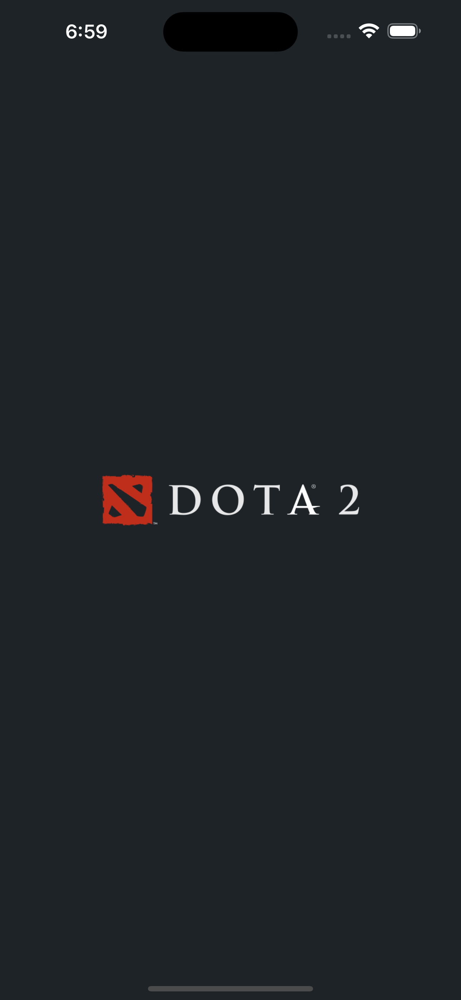
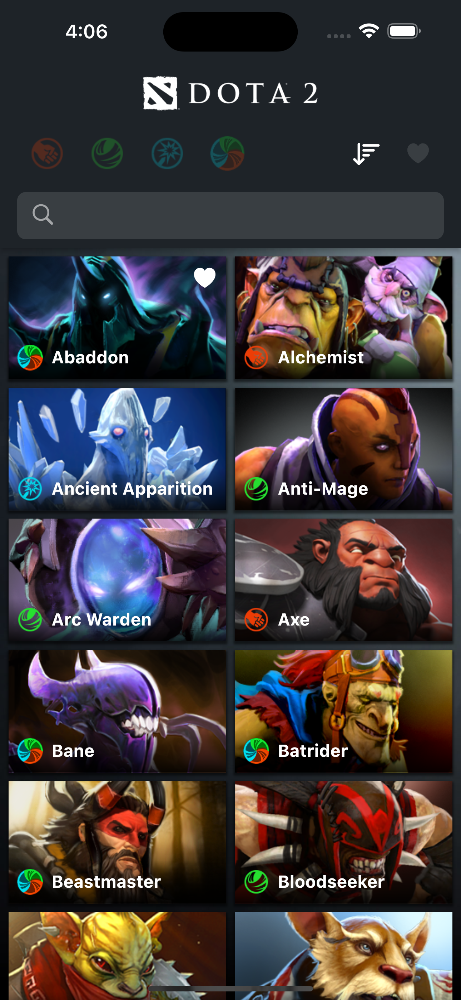
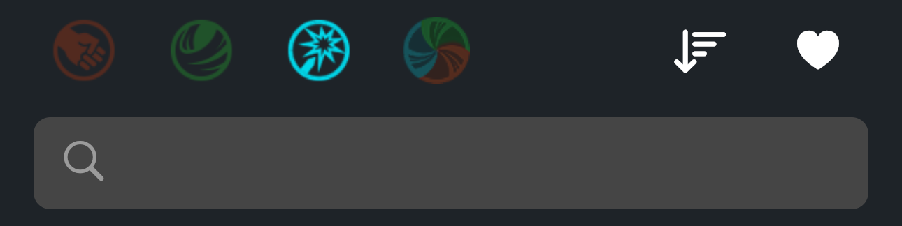
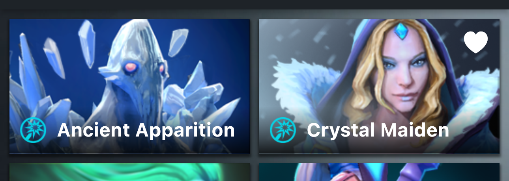
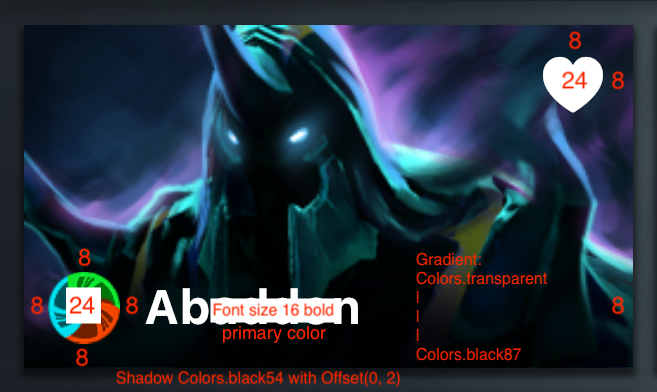
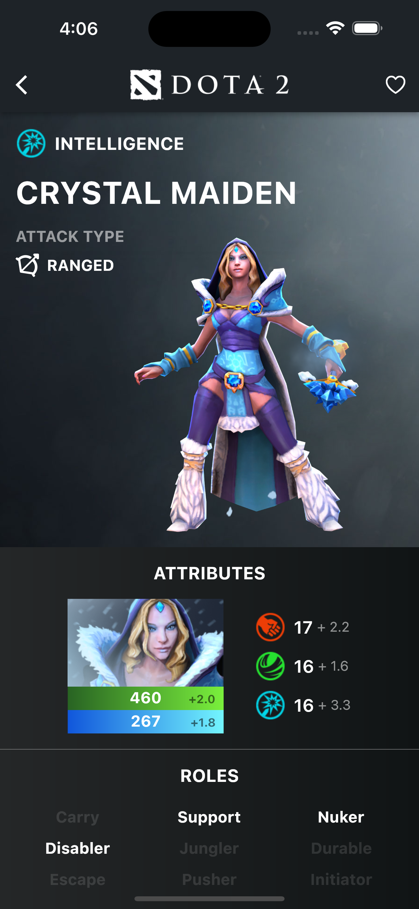
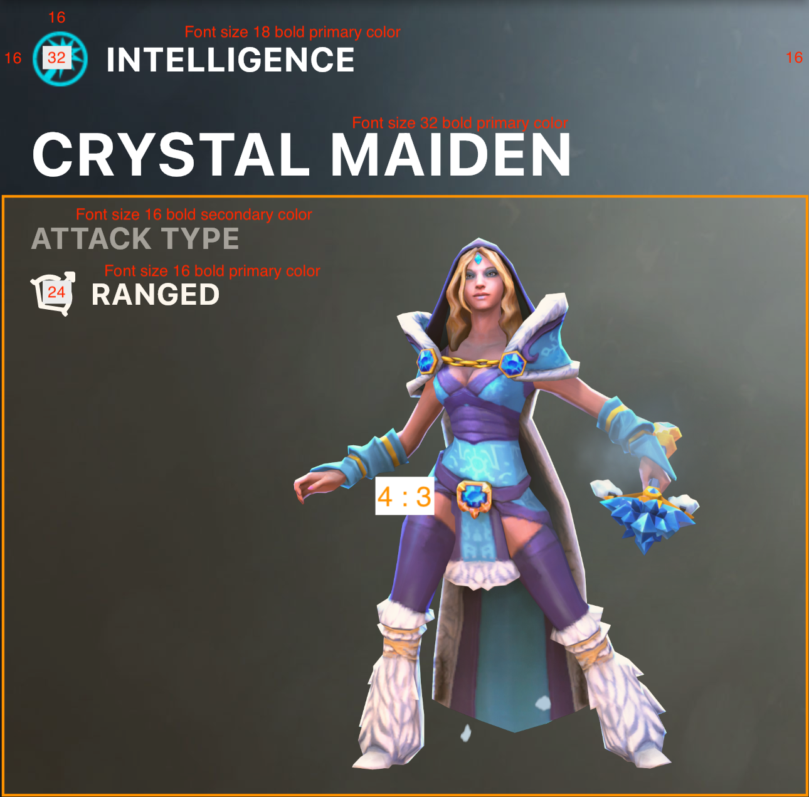
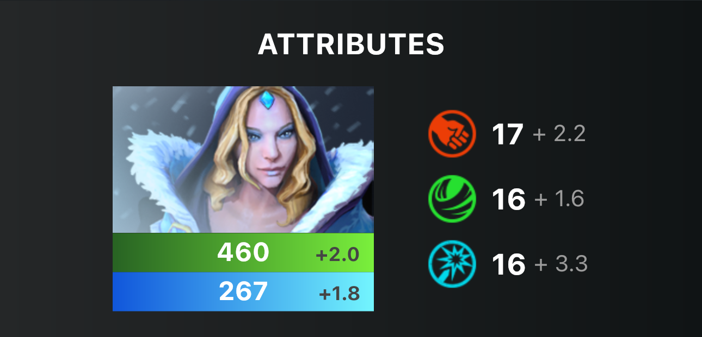
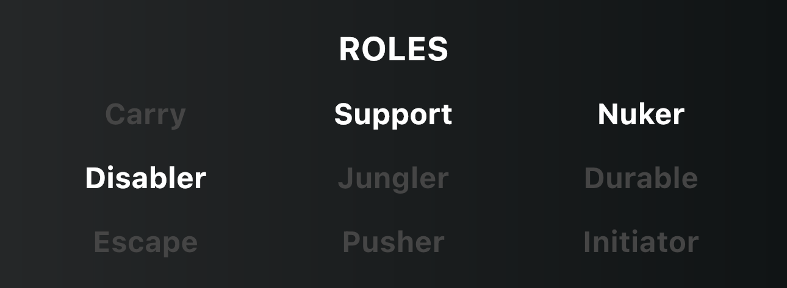
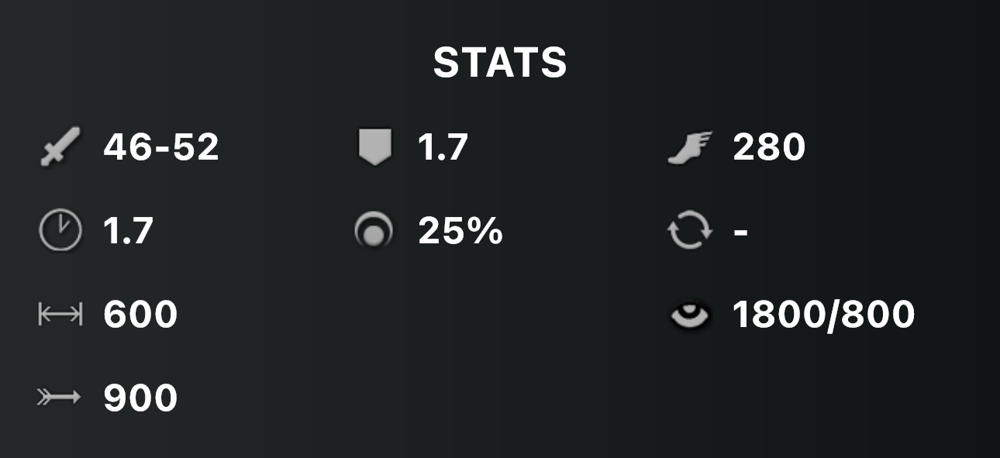

# Dota Heroes Flutter Example UI

- [Resources](#resources)
- [Colors](#colors)
- [Home](#home)
- [Dota Hero Detail](#dota-hero-detail)

## Resources 

- [images](images)

## Colors

PrimarySwatch

- PrimaryBlack `#1E2328`

Content

- Primary `#FFFFFF`
- Secondary `#9B9B9B`
- Tertiary `#454545`

## Splash

## Home

1. App Bar Bottom

    
    
    - Sort 
      - Ascending Icon `CupertinoIcons.sort_down`
      - Descending Icon `CupertinoIcons.sort_up`
    - Show Favorite Icon `CupertinoIcons.heart_fill`
    - SearchBar PrefixIcon `CupertinoIcons.search` with **Content Secondary Color**
      
2. Grid

    
    
3. Tile

    

    - AspectRatio `16.0 / 9.0`
    - Show Favorite Icon `CupertinoIcons.heart_fill` with **Content Primary Color** if already added to favorites
      
## Dota Hero Detail

1. Header

    
    
    - Example potrait image url `https://cdn.cloudflare.steamstatic.com/apps/dota2/videos/dota_react/heroes/renders/crystal_maiden.png`
    
2. Attributes

    
    
3. Roles

    
    
4. Stats

    
