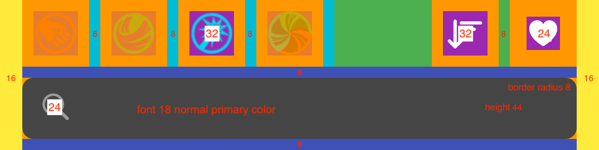
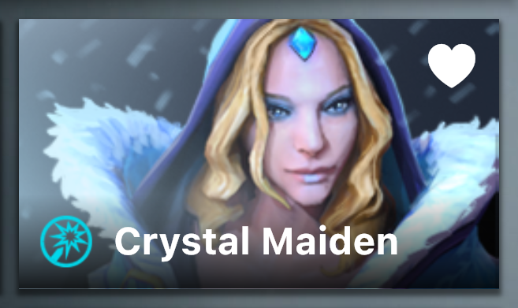
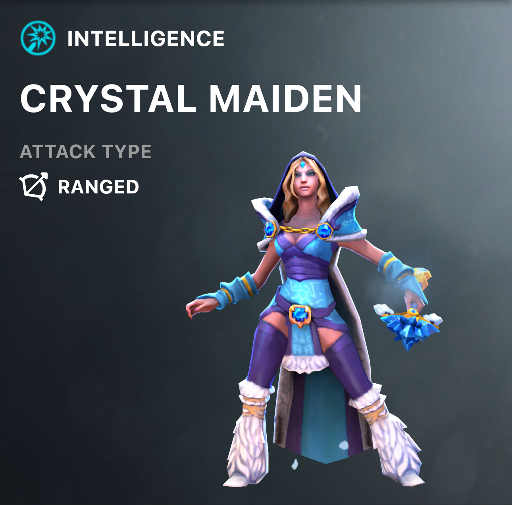

# Dota Heroes Flutter Example UI

- [Resources](#resources)
- [Colors](#colors)
- [Home](#home)
- [Dota Hero Detail](#dota-hero-detail)

## Resources 

- Assets Images Download [Here](images)

## Colors

PrimarySwatch

- PrimaryBlack `#1E2328`

Content

- Primary `#FFFFFF`
- Secondary `#9B9B9B`
- Tertiary `#454545`

## Splash

## Home

1. App Bar Bottom

    
    
    
    
    - Filter Primary Attribute (Deselected Opacity `0.25`)
    - Sort
      - Ascending Icon `CupertinoIcons.sort_down`
      - Descending Icon `CupertinoIcons.sort_up`
    - Show Favorite Icon `CupertinoIcons.heart_fill` (Deselected Opacity `0.25`)
    - SearchBar PrefixIcon `CupertinoIcons.search`
      
2. Grid
    
    
    
    
    
3. Tile
    
     

    - AspectRatio `16.0 / 9.0`
    - Shadow `Colors.black54` with `Offset(0,2)`
    - Show Favorite Icon `CupertinoIcons.heart_fill` with **Content Primary Color** if already added to favorites
    - Name Container gradient from **Top** `Colors.transparent` to **Bottom** `Colors.black87`
      
## Dota Hero Detail

1. Header

    
    
    

    - Example potrait image url `https://cdn.cloudflare.steamstatic.com/apps/dota2/videos/dota_react/heroes/renders/crystal_maiden.png`
    
2. Attributes

    
    
    
    
    - Grident background from **Left** `#252728` to **Right** `#101415`
    - Health Bar Grident background from **Left** `#286323` to **Right** `#7AF03C`
    - Mana Bar Grident background from **Left** `#1056DB` to **Right** `#73F5FE`
    - Health = `baseHealth` + (`baseStr` * 20.0)
    - HealthRegen = `baseHealthRegen` + (`baseStr` * 0.1)
    - Mana = `baseMana` + (`baseInt` * 12.0)
    - ManaRegen = `baseManaRegen` + (`baseInt` * 0.05)
    
3. Roles

    
    
    
    
    - Grident background from **Left** `#252728` to **Right** `#101415`
    
4. Stats

    
    
    
    
    - Grident background from **Left** `#252728` to **Right** `#101415`
    - AttackMin if Primary Attribute
      - Strength: `baseAttackMin` + `baseStr`
      - Agility: `baseAttackMin` + `baseAgi`
      - Intelligence: `baseAttackMin` + `baseInt`
      - Universal: `baseAttackMin` + (`baseStr` * 0.6) + (`baseAgi` * 0.6) + (`baseInt` * 0.6)
    - AttackMax if Primary Attribute
      - Strength: `baseAttackMax` + `baseStr`
      - Agility: `baseAttackMax` + `baseAgi`
      - Intelligence: `baseAttackMax` + `baseInt`
      - Universal: `baseAttackMax` + (`baseStr` * 0.6) + (`baseAgi` * 0.6) + (`baseInt` * 0.6)
    - Armor = `baseArmor` + (`baseAgi` * 0.167)
   
